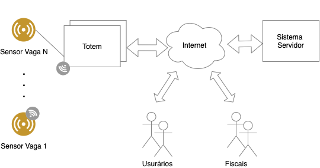

# Repositório da disciplina de Projeto Integrador 2 do semestre 2020/2

## Sala de aula:
https://meet.google.com/vkh-vdnt-uzf

[Plano](https://wiki.sj.ifsc.edu.br/index.php/PJI2-EngTel_(Plano_de_Ensino))

[Moodle](https://moodle.ifsc.edu.br/course/view.php?id=7444)

## Características da Disciplina

- Grau de independência médio com relação ao tutor.

- Casos de insucesso:
Porque não deu certo? Como eu fiz?

- Pesquisa de como executar tarefas:
Como eu efetuei a pesquisa?

- Projeto vai além dos limites da sala de aula.

- Os checkpoints devem ser respeitados.
Apresentações nos checkpoints devem ser organizados previamente e cada aluno deve apresentar suas contribuições.

- É responsabilidade do grupo demandar equipamentos, softwares, recursos de forma geral.

## Discussão
- Características da disciplina

- Formação das equipes

- Formato dos seminários (vídeo)

- Propostas de projetos

## Seminários

1- Objetivos e tópicos

O objetivo do seminário é a revisão dos conceitos de modelagem vistos na disciplina de Programação Orientada a Objetos (POO).

- Tópico 1: Introdução
Visão geral (Cap. 1), excluir 1.3 (visão histórica).
Processo de desenvolvimento de software (cap. 2), excluir ferramenta Case (2.6).
Mecanismos gerais (Cap. 3).
- Tópico 2: Modelagem de casos de uso (cap. 4)
Modelo de casos de uso.
Diagrama de casos de uso. Detalhar tipos de relacionamentos (comunicação, extensão, inclusão e generalização).
Identificação dos elementos, construção do modelo e documentação suplementar.
- Tópico 3: Modelagem de classes de análise (Cap. 5)
Estágios do modelo
Diagrama de classes
Tópico 4: Modelagem de interações (Cap. 7)
Diagramas comportamentais
Diagrama de sequência
Modularização de interações

2- Orientações

Ler capítulos;
Preparar slides (Dica: discuta como será a abordagem da apresentação com o professor antes de começar os slides);
Preparar cinco (5) questões de múltipla escolha que podem ser respondidas a partir da apresentação;
Gravar uma apresentação com duração de 30 min;
Enviar para o professor a apresentação e as questões com resolução até dia 28/11.

3- Sorteio

Resultado: Guilherme – Jhonatan – Bruno – Amanda

## Proposta Projetos
Sistema de estacionamento "zona azul" para uma cidade.

**Requisitos iniciais:**

- Prever a possibilidade de vários totems para cobrir a cidade toda.
- O usuário pode fazer o pagamento no Totem ou por meio digital usando o smartphone.
- Os sensores podem ser com fio ou sem fio.
- O totem deve prover uma interface de serviço para adição, configuração e remoção de sensores.

**O sistema servidor deve:**

- Reportar o número de vagas ocupadas;
Localização de vagas na cidade;
- Gerar sinais de alerta para os fiscais;
Informações para usuário sobre o tempo decorrido;
- Gerar alerta de tempo expirado.
Atividade:

**Atividade 1:** Fazer uma descrição textual ou gráfica do funcionamento do sistema.
